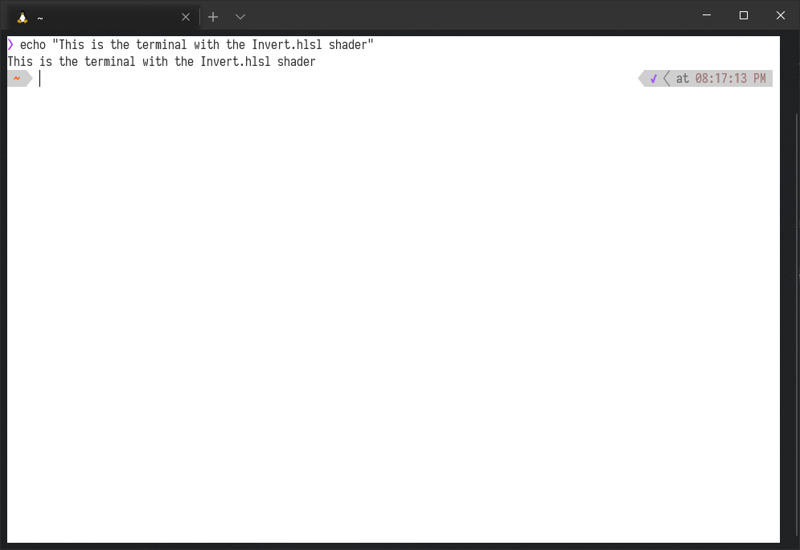
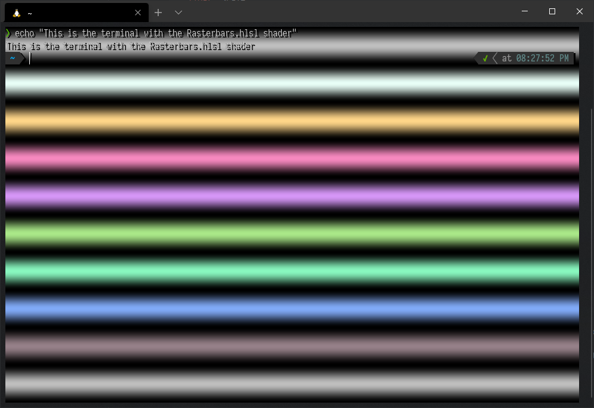
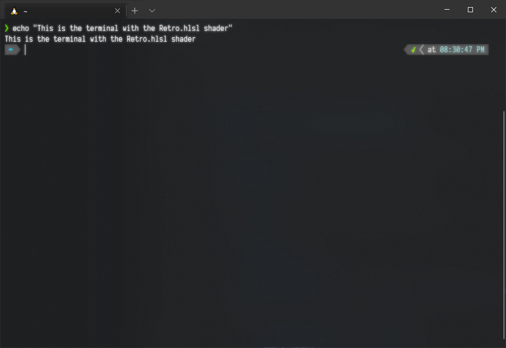

# Pixel Shaders in Windows Terminal

Due to the sheer amount of computing power in GPUs, one can do awesome things with pixel shaders such as real-time fractal zoom, ray tracers and image processing.

Windows Terminal allows user to provide a pixel shader which will be applied to the terminal. To try it out, add the following setting to one of your profiles:

```
"experimental.pixelShaderPath": "<path to a .hlsl pixel shader>"
```
> **Note**: if you specify a shader with `experimental.pixelShaderPath`, the Terminal will use that instead of the `experimental.retroTerminalEffect`.

To get started using pixel shaders in the Terminal, start with the following sample shader. This is `Invert.hlsl` in this directory:

```hlsl
// A minimal pixel shader that inverts the colors

// The terminal graphics as a texture
Texture2D shaderTexture;
SamplerState samplerState;

// Terminal settings such as the resolution of the texture
cbuffer PixelShaderSettings {
  // Time since pixel shader was enabled
  float  Time;
  // UI Scale
  float  Scale;
  // Resolution of the shaderTexture
  float2 Resolution;
  // Background color as rgba
  float4 Background;
};

// A pixel shader is a program that given a texture coordinate (tex) produces a color
//  Just ignore the pos parameter
float4 main(float4 pos : SV_POSITION, float2 tex : TEXCOORD) : SV_TARGET
{
    // Read the color value at the current texture coordinate (tex)
    //  float4 is tuple of 4 floats, rgba
    float4 color = shaderTexture.Sample(samplerState, tex);

    // Inverts the rgb values (xyz) but don't touch the alpha (w)
    color.xyz = 1.0 - color.xyz;

    // Return the final color
    return color;
}
```

Save this file as `C:\temp\invert.hlsl`, then update a profile with the setting:

```
"experimental.pixelShaderPath": "C:\\temp\\invert.hlsl"
```

Once the settings file is saved, open a terminal with the changed profile. It should now invert the colors of the screen!


 Default Terminal | Inverted Terminal 
---------|---------
  |  


If your shader fails to compile, the Terminal will display a warning dialog and ignore it temporarily. After fixing your shader, touch the `settings.json` file again, or open a new tab, and the Terminal will try loading the shader again.

## HLSL

The language we use to write pixel shaders is called `HLSL`. It's a `C`-like language, with some restrictions. You can't allocate memory, use pointers or recursion.
What you get access to is computing power in the teraflop range on decently recent GPUs. This means writing real-time raytracers or other cool effects are in the realm of possibility.

[shadertoy](https://shadertoy.com/) is a great site that show case what's possible with pixel shaders (albeit in `GLSL`). For example this [menger sponge](https://www.shadertoy.com/view/4scXzn). Converting from `GLSL` to `HLSL` isn't overly hard once you gotten the hang of it.

## Adding some retro raster bars

Let's try a more complicated example. Raster bars was cool in the 80's, so let's add that. Start by modifying shader like so: (This is `Rasterbars.hlsl`)

```hlsl
// A minimal pixel shader that shows some raster bars

// The terminal graphics as a texture
Texture2D shaderTexture;
SamplerState samplerState;

// Terminal settings such as the resolution of the texture
cbuffer PixelShaderSettings {
  // Time since pixel shader was enabled
  float  Time;
  // UI Scale
  float  Scale;
  // Resolution of the shaderTexture
  float2 Resolution;
  // Background color as rgba
  float4 Background;
};

// A pixel shader is a program that given a texture coordinate (tex) produces a color
//  Just ignore the pos parameter
float4 main(float4 pos : SV_POSITION, float2 tex : TEXCOORD) : SV_TARGET
{
    // Read the color value at the current texture coordinate (tex)
    //  float4 is tuple of 4 floats, rgba
    float4 color = shaderTexture.Sample(samplerState, tex);

    // Read the color value at some offset, will be used as shadow
    float4 ocolor = shaderTexture.Sample(samplerState, tex+2.0*Scale*float2(-1.0, -1.0)/Resolution.y);

    // Thickness of raster
    const float thickness = 0.1;

    float ny = floor(tex.y/thickness);
    float my = tex.y%thickness;
    const float pi = 3.141592654;


    // ny is used to compute the rasterbar base color
    float cola = ny*2.0*pi;
    float3 col = 0.75+0.25*float3(sin(cola*0.111), sin(cola*0.222), sin(cola*0.333));

    // my is used to compute the rasterbar brightness
    //  smoothstep is a great little function: https://en.wikipedia.org/wiki/Smoothstep
    float brightness = 1.0-smoothstep(0.0, thickness*0.5, abs(my - 0.5*thickness));

    float3 rasterColor = col*brightness;

    // lerp(x, y, a) is another very useful function: https://en.wikipedia.org/wiki/Linear_interpolation
    float3 final = rasterColor;
    // Create the drop shadow of the terminal graphics
    //  .w is the alpha channel, 0 is fully transparent and 1 is fully opaque
    final = lerp(final, float(0.0), ocolor.w);
    // Draw the terminal graphics
    final = lerp(final, color.xyz, color.w);

    // Return the final color, set alpha to 1 (ie opaque)
    return float4(final, 1.0);
}
```

Once reloaded, it should show some retro raster bars in the background, with a drop shadow to make the text more readable.

 

## Retro Terminal Effect

As a more complicated example, the Terminal's built-in `experimental.retroTerminalEffect` is included as the `Retro.hlsl` file in this directory. 



Feel free to modify and experiment!

